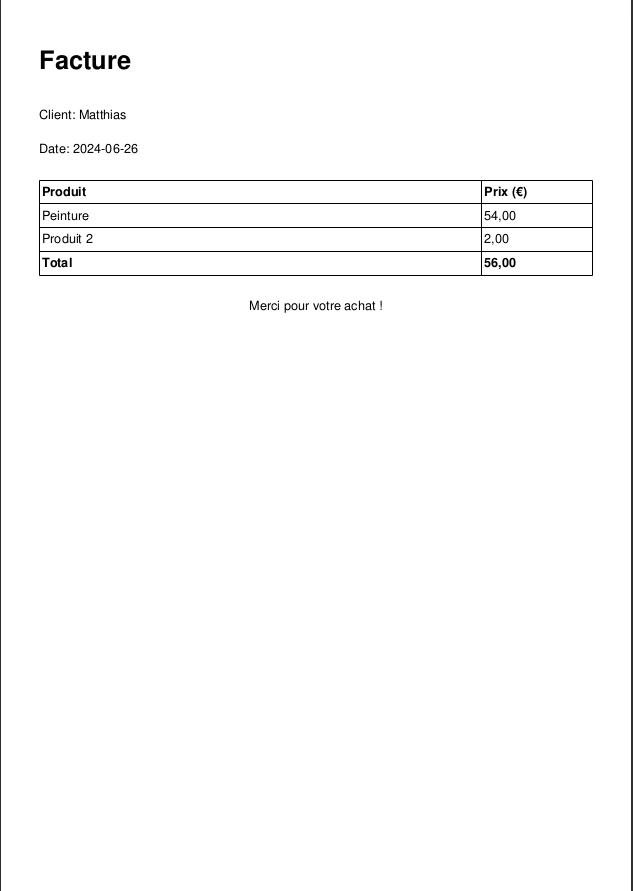

# Facturator

Facturator est une application JavaFX permettant de créer et gérer des factures. Elle permet d'ajouter des produits avec leurs prix, de calculer le total et de générer une facture au format PDF.

## Fonctionnalités

- Ajouter des produits avec leur nom et prix
- Afficher la liste des produits ajoutés
- Calculer le total des prix des produits ajoutés
- Générer une facture au format PDF

## Prérequis

- JDK 17 ou version ultérieure
- Maven

## Installation

Clonez le dépôt GitHub :

```bash
git clone https://github.com/votre-utilisateur/facturator.git
cd facturator
```


## Compilation et exécution
Pour compiler et exécuter l'application, utilisez Maven :

```
mvn clean install
mvn javafx:run
```

## L'interface 

- L'interface utilisateur est très simple la voici :


- Et voici un exemple de facture générée :




